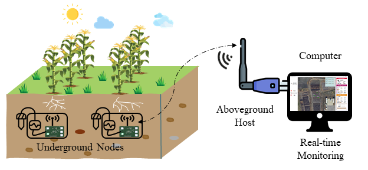
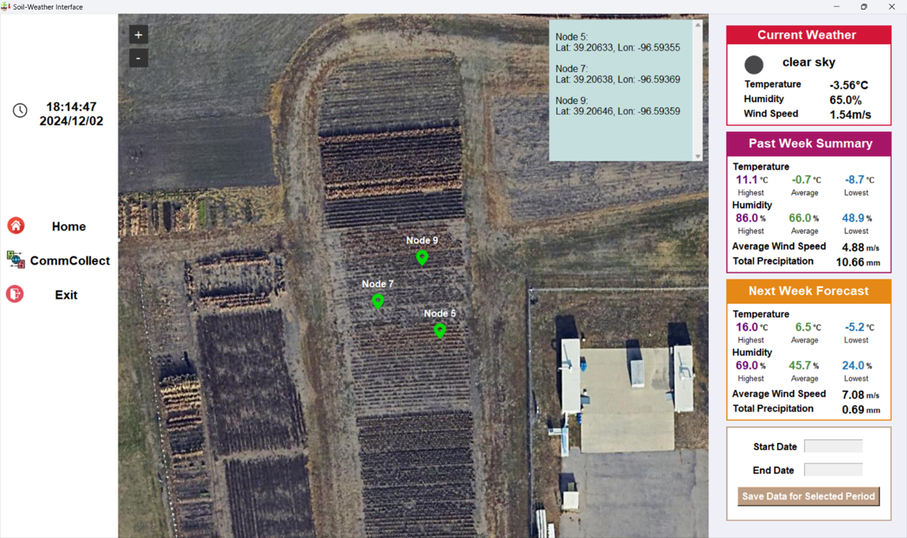
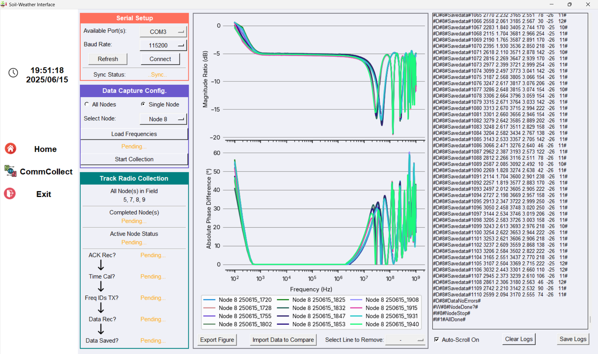

# Soil Sensor Firmware and Interface

This repository contains the **C firmware** for a dielectric soil sensor system and a **Python-based interface** for data acquisition and communication with the above-ground host. The code is part of a project for **real-time monitoring of soil moisture and nutrients**.

---

## System Overview

The system consists of three main components:

1. **Soil Sensor Probe** – measures the dielectric response of soil.  
2. **Aboveground Host** – receives wireless data from the sensor and forwards it to the interface.  
3. **Python Interface** – logs, visualizes, and manages data on a host computer.

  
*Figure 1: Data flow from soil sensor to host and Python interface. The sensor collects data, the host receives it via wireless communication (SX1262 LoRa), and the Python interface processes and visualizes it.*

---

## Interface

### Homepage
  
*Figure 2: Homepage of the Python interface. Displays satellite maps showing sensor locations and weather summary information.*

### Communication & Data Collection Page
  
*Figure 3: Communication page used for data collection settings, monitoring sensor status, and visualizing real-time data.*

---

## Repository Contents

- `CommInterface/`  
  Python scripts for:
  - Receiving and logging data from the sensor
  - Real-time visualization of soil dielectric responses
  - Communication between the sensor and host computer

- `Sensor_Final_F3/`  
  C code for the dielectric sensor, handling measurement and wireless communication.

- `SX1262_Host_V2/`  
  C code for the aboveground host, handling wireless communication and forwarding data to the Python interface.

---

## Features

- Real-time acquisition of soil dielectric spectra  
- Wireless communication between sensor probe and host computer  
- Data logging in standard formats (CSV) for further analysis  
- Cross-platform Python interface for visualization and control  
- Map-based visualization of sensor locations and environmental data  
